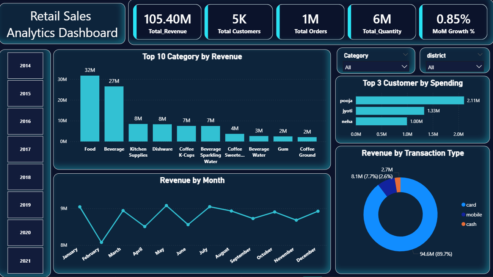
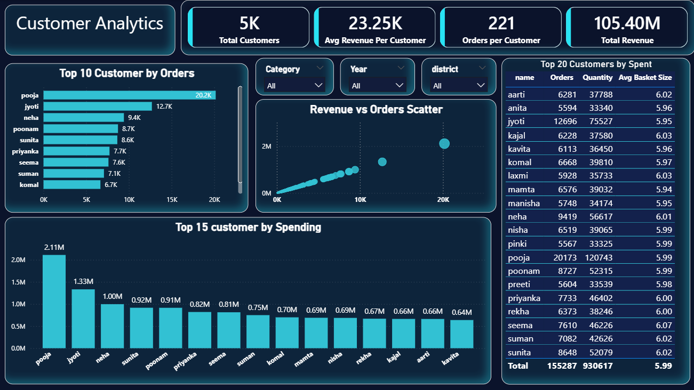
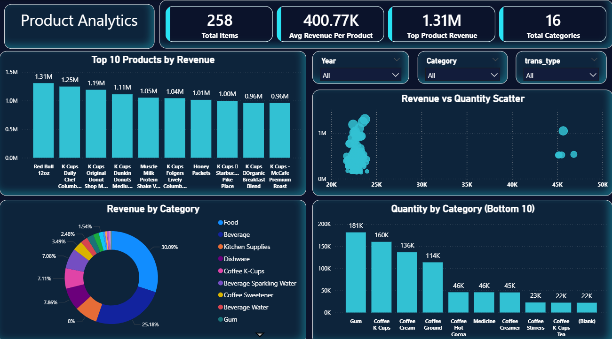
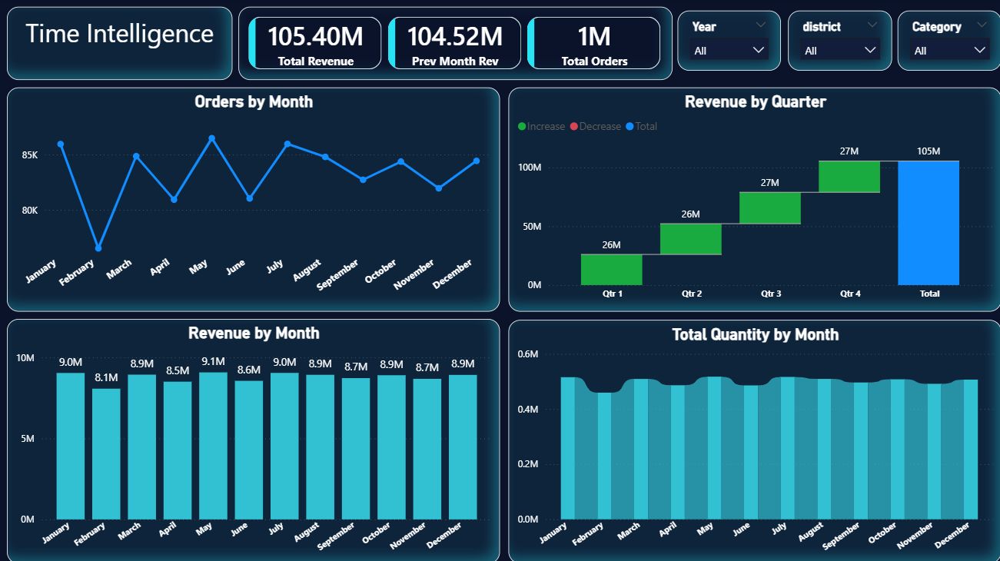
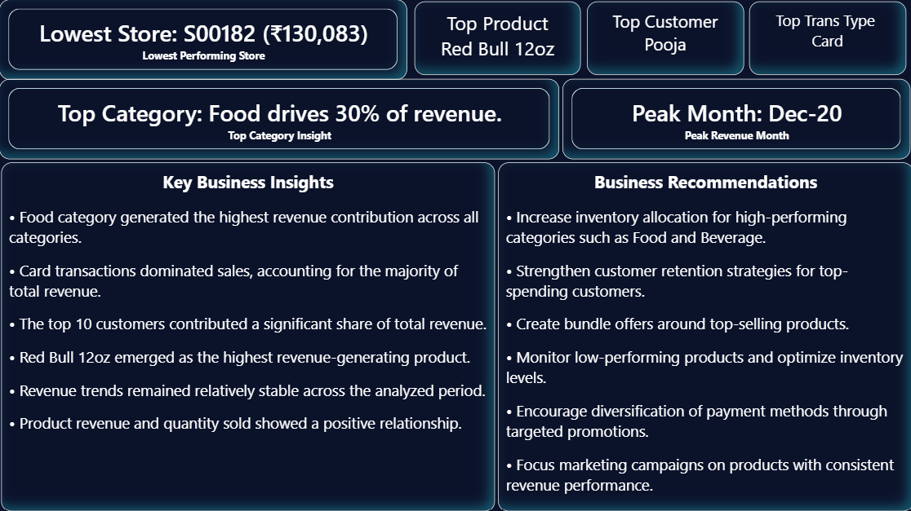

#  Retail Sales Analytics Dashboard

An end-to-end Retail Sales Analytics project built using Python, SQL, and Power BI to analyze sales performance, customer behavior, product trends, and business insights from a large retail dataset.

---

##  Project Overview

This project demonstrates the complete data analytics workflow:

- Data Cleaning & Preparation
- Exploratory Data Analysis (EDA)
- SQL Business Analysis
- Data Modeling
- DAX Measures & KPIs
- Interactive Power BI Dashboard
- Business Insights & Recommendations

The dashboard helps stakeholders monitor revenue, customer performance, product performance, and sales trends to support data-driven decision-making.

---

## Tools & Technologies

- Python
  - Pandas
  - NumPy
  - Matplotlib
  - Seaborn

- SQL
  - Joins
  - Aggregations
  - Window Functions
  - Business Queries

- Power BI
  - Data Modeling
  - DAX Measures
  - Interactive Visualizations
  - Slicers & Filters

---

##  Dataset Information

The dataset contains retail sales transactions from 2014 to 2021.

### Key Metrics

- Revenue: ₹105.4M+
- Orders: 1M+
- Customers: 5K+
- Products: 258
- Categories: 16

### Main Dimensions

- Customer
- Product
- Store
- Transaction Type
- Category
- Date

---

#  Exploratory Data Analysis (EDA)

Performed extensive EDA using Python to understand:

- Missing values
- Data quality issues
- Revenue distribution
- Category performance
- Customer spending behavior
- Monthly sales trends
- Product performance

### EDA Highlights

- Food category generated the highest revenue.
- Beverage category was the second-largest contributor.
- Revenue remained relatively stable across months.
- Customer spending was concentrated among a small group of high-value customers.

---

#  SQL Analysis

Business-focused SQL queries were written to analyze:

- Top-selling products
- Top customers
- Category performance
- Revenue trends
- Store performance
- Customer purchasing behavior

### Example Business Questions

- Which products generate the highest revenue?
- Which customers contribute the most sales?
- What are the best-performing categories?
- Which stores underperform?
- How does revenue vary over time?

---

#  Power BI Dashboard

The dashboard consists of 5 interactive pages.

---

##  Page 1: Executive Overview

Provides a high-level business summary.

### KPIs

- Total Revenue
- Total Customers
- Total Orders
- Total Quantity
- MoM Growth %

### Visuals

- Revenue by Category
- Monthly Revenue Trend
- Top Customers by Spending
- Revenue by Transaction Type

---

##  Page 2: Customer Analytics

Analyzes customer behavior and spending patterns.

### KPIs

- Total Customers
- Average Revenue per Customer
- Orders per Customer
- Total Revenue

### Visuals

- Top Customers by Revenue
- Top Customers by Orders
- Revenue vs Orders Scatter Plot
- Customer Performance Table

---

##  Page 3: Product Analytics

Evaluates product and category performance.

### KPIs

- Total Products
- Average Revenue per Product
- Top Product Revenue
- Total Categories

### Visuals

- Top Products by Revenue
- Revenue by Category
- Revenue vs Quantity Scatter Plot
- Quantity by Category

---

##  Page 4: Time Intelligence

Tracks business performance over time.

### KPIs

- Total Revenue
- Previous Month Revenue
- Total Orders

### Visuals

- Revenue by Month
- Orders by Month
- Revenue by Quarter
- Total Quantity by Month

---

##  Page 5: Business Insights & Recommendations

Provides actionable insights for decision-makers.

### Key Insights

- Food category contributes ~30% of total revenue.
- Card transactions dominate total sales.
- Red Bull 12oz is the top-performing product.
- Pooja is the highest-spending customer.
- Revenue remains stable throughout the analyzed period.

### Recommendations

- Increase inventory allocation for high-performing categories.
- Strengthen customer retention programs.
- Create promotional bundles around top-selling products.
- Monitor low-performing products.
- Diversify payment method adoption.

---

#  Dashboard Screenshots

## Executive Overview

## Customer Analytics

## Product Analytics

## Time Intelligence

## Business Insights

---

#  Key Business Findings

Food category generated the highest revenue contribution.
Card payments accounted for the majority of transactions.
Revenue remained consistent across months.
A small group of customers contributed a large share of revenue.
Certain products significantly outperformed the rest of the catalog.

---

#  Future Improvements

- Sales Forecasting
- Customer Segmentation (RFM Analysis)
- Profitability Analysis
- Inventory Optimization Dashboard
- Geographic Performance Analysis

---

#  Author

**Ishwar Sahani**

Aspiring Data Analyst | SQL | Python | Power BI

LinkedIn: www.linkedin.com/in/ishwarsahani18

GitHub: https://github.com/Mystic-Ishwar
---

 If you found this project useful, feel free to star the repository.